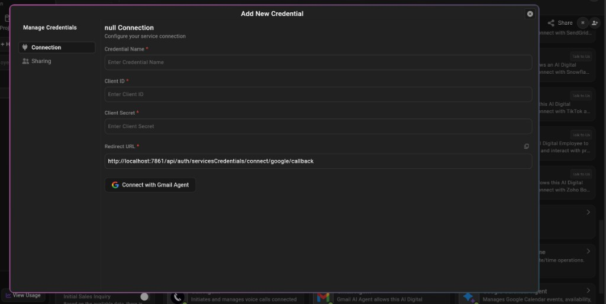
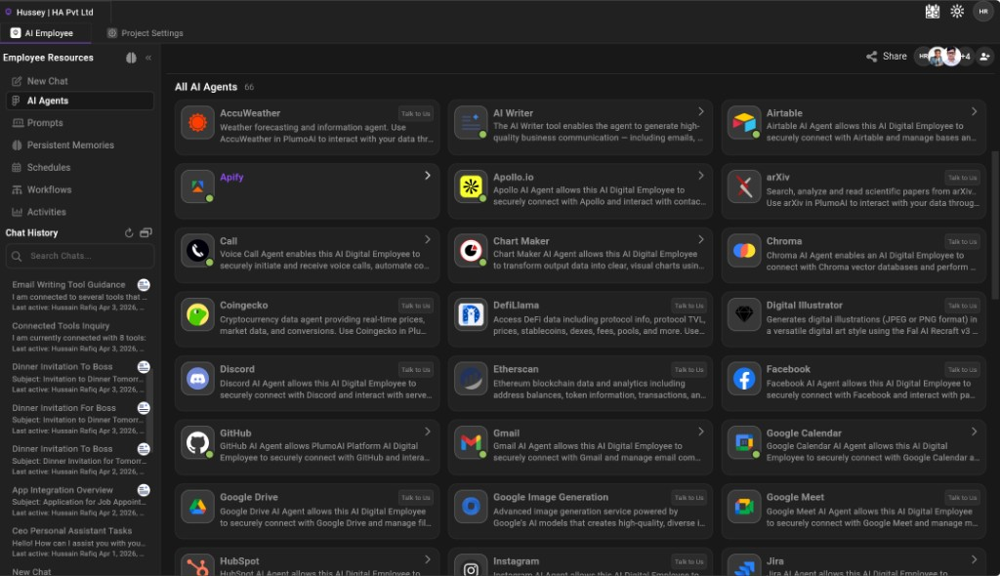
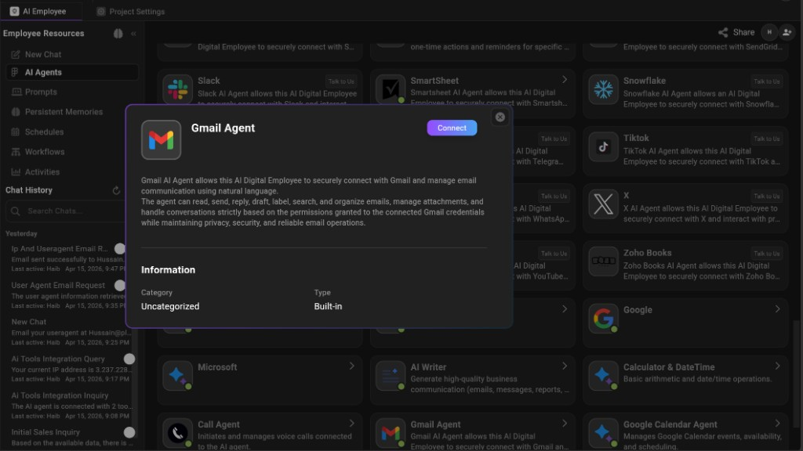
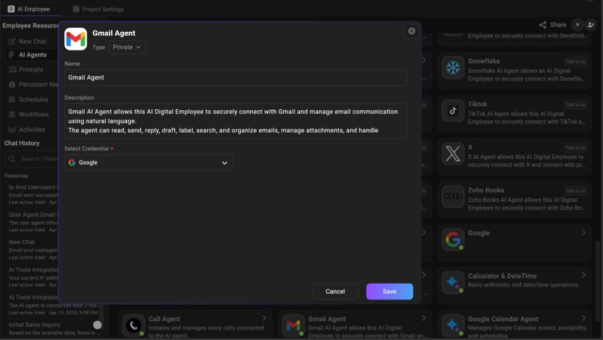
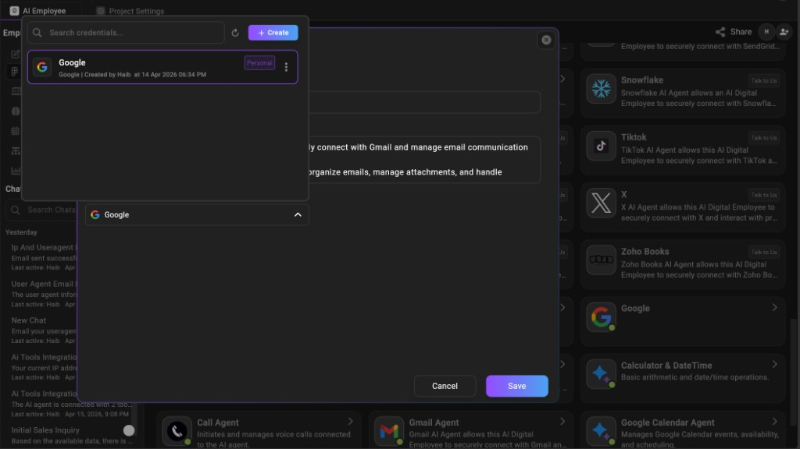

## AI Agent + Service Provider Creation Guide (Production)

> **Purpose**: A production-ready, UI-first guide to ship new AI agents and new service providers by **adding folders**—no internal persistence details, no deployment secrets, and no direct API references.

This guide explains how to add **new AI Agents** and (optionally) **new Service Providers** so anyone can enable them by **adding a folder** under:

- `ai-agents/` (AI Agent plugins)
- `service-providers/` (shared authentication providers)

It is intentionally **implementation-agnostic**:

- No DB / internal platform logic
- No environment variable names or deployment secrets in this document
- No external paths
- No direct API endpoint references (configure/connect from the UI)

---

### Table of contents

- [What you can build](#what-you-can-build)
- [Folder contract (what must exist on disk)](#1-folder-contract-what-must-exist-on-disk)
- [AI Agent folder layout (supported)](#11-ai-agent-folder-layout-supported)
- [Create a new AI Agent](#2-create-a-new-ai-agent-recommended-workflow)
- [Dependencies inside your agent class](#21-dependencies-inside-your-agent-class-do-not-skip)
- [Multi-step plans & placeholders](#22-multi-step-plans-dependency-placeholders-and-raise-a-step-behavior-critical)
- [When does an agent need a Service Provider?](#3-when-does-an-agent-need-a-service-provider-auth)
- [Create a new Service Provider](#4-create-a-new-service-provider-auth-provider-catalog)
- [Drop-in folder enablement checklist](#5-drop-in-folder-enablement-checklist-what-a-user-does)
- [Safe update rules](#6-safe-update-rules-production)
- [Common causes of “plugin not loading”](#7-common-causes-of-plugin-not-loading)
- [Copy-from-real-examples](#8-copy-from-real-examples-already-in-this-repo)

### Quick glossary

- **AI Agent (tool)**: a capability the AI Employee can call (search, email, calendar, database, etc.).
- **Plugin folder**: `ai-agents/<agent_code>/` containing `plugin.json` + Python code.
- **Service Provider**: a reusable auth provider definition (e.g., Google / Microsoft) stored under `service-providers/<provider_code>/provider.json`.
- **`plugin_id`**: unique ID for the agent plugin (must not collide).
- **`app_codes`**: one or more “invocation names” for the same plugin.
- **`service_provider_code`**: links an agent to a provider so the UI can show “Connect account”.

---

## What you can build

### 1) Agent without auth (no external account needed)

Use this for tools like calculators, formatters, pure knowledge-base search, etc.

### 2) Agent with auth (external account needed)

Use this for agents that require the user/company to connect an account (OAuth2 or API token).

This is done by:

- Adding `service_provider_code` in the agent’s `plugin.json`
- Ensuring the provider exists under `service-providers/<code>/provider.json`
- Connecting the provider from the UI (one-time per user/company as your UI supports)

---

## 1) Folder contract (what must exist on disk)

### Operator prerequisite (so folders are actually loaded)

> **UI-first rule**: If something doesn’t appear, don’t debug from code first. Restart the running processes and hard-refresh the UI. Folder-based plugins/providers only show up after reload.

Your deployment must be configured so:

- The **service provider catalog loader** reads the `service-providers/` root
- The **AI agent plugin loader** reads the `ai-agents/` root

After adding or changing folders/files, **restart** the relevant running processes and then **refresh the UI**. (Exact component names depend on your deployment.)

### Required layout for every AI Agent

```text
ai-agents/
  <agent_code>/
    plugin.json
    entrypoint.py
    __init__.py
    <agent_code>_agent_tool.py
    (optional) icons/assets...
    (optional) more python modules...
```

### Required layout for every Service Provider

```text
service-providers/
  <provider_code>/
    provider.json          (recommended)
    config.json            (recommended for OAuth URLs/credentials)
    meta.json              (optional)
    (optional) icon.svg / png...
```

### Supported service provider file merge order

If multiple JSON files exist for the same provider, they combine like this:

1. `meta.json` (optional base object)
2. `provider.json` (merged on top)
3. `config.json` (merged into the top-level `config` object)

**Practical split (recommended):**

- Put **labels + form schema** in `provider.json`
- Put **technical OAuth settings + client credentials** in `config.json`

---

## 1.1) AI Agent folder layout (supported)

This project uses a **flat** agent plugin layout. Do not create nested provider folders under `ai-agents/`.

### Flat layout (supported)

```text
ai-agents/
  <agent_code>/
    plugin.json
    ...
```

### Provider relationship (how the agent references auth)

Service providers stay in their own catalog:

- `service-providers/<provider_code>/...`

AI agents reference a provider **only** via `plugin.json`:

- `ai-agents/<agent_code>/plugin.json` → `"service_provider_code": "<provider_code>"`

**Rule:** the `service_provider_code` in `plugin.json` must match the provider folder name under `service-providers/`.

---

## 2) Create a new AI Agent (recommended workflow)

### Step A: choose your agent code

Pick a short, stable code (lowercase + underscores):

- Good: `invoice_writer`, `slack`, `jira_search`
- Avoid: spaces, uppercase, special characters

This `<agent_code>` becomes:

- Folder name: `ai-agents/<agent_code>/`
- `plugin_id` (recommended to match folder name)
- The default value in `app_codes` (recommended)

### Step B: create `plugin.json` (agent manifest)

Create `ai-agents/<agent_code>/plugin.json`.

**Manifest filename fallback (compat):**

Some deployments look for agent manifests in this order:

1. `plugin.json`
2. `app.json`
3. `manifest.json`

For best compatibility, always use **`plugin.json`**.

#### Minimal manifest (no auth)

```json
{
  "plugin_id": "<agent_code>",
  "app_codes": ["<agent_code>"],
  "type": "python_tool_agent",
  "display_name": "Human Friendly Name",
  "description": "One sentence: what it does.",
  "entrypoint": "entrypoint.py",
  "auto_attach_to_all_agents": true
}
```

#### Manifest with auth (connect account in UI)

Add `service_provider_code` and (optionally) an icon.

```json
{
  "plugin_id": "<agent_code>",
  "app_codes": ["<agent_code>"],
  "type": "python_tool_agent",
  "display_name": "Human Friendly Name",
  "description": "One sentence: what it does.",
  "entrypoint": "entrypoint.py",
  "service_provider_code": "<provider_code>",
  "required_fields": [],
  "icon": "<icon_filename>",
  "auto_attach_to_all_agents": false
}
```

**Production rules for `plugin.json`:**

- **`plugin_id` must be unique** across all agent folders.
- **`app_codes` must be a non-empty array** (strings).
- **`type` must be `python_tool_agent`** for Python agents.
- **`entrypoint` must point to a file that exists** in the same folder.
- If you add `service_provider_code`, the provider must exist under `service-providers/<provider_code>/provider.json`.

### Step C: create `entrypoint.py` (plugin factory)

Create `ai-agents/<agent_code>/entrypoint.py`.

```python
from __future__ import annotations

from typing import Any, Dict, Optional

from .<agent_code>_agent_tool import <AgentClassName>


async def create_tool_agent(
    *,
    app_code: str,
    app_config: Dict[str, Any],
    llm_provider: Any,
    token: str,
    user_id: int,
    company_id: Optional[str] = None,
    agent_id: Optional[str] = None,
):
    agent = <AgentClassName>(
        llm_provider=llm_provider,
        agent_id=agent_id or "",
        token=token,
        company_id=company_id,
        user_id=user_id,
        app_config=app_config or {},
    )
    if hasattr(agent, "initialize"):
        await agent.initialize()
    return agent
```

**Notes:**

- Keep the function name **exactly** `create_tool_agent`.
- Use **relative imports** inside the agent folder (`from .x import y`).

### Step D: create your tool class (the runtime behavior)

Create `ai-agents/<agent_code>/<agent_code>_agent_tool.py`.

Your class must:

- Extend the platform tool base class (`BaseToolAgent`)
- Implement `run(...)` as an async generator
- Always yield a **final** event
- Never leak secrets in yielded events or logs

```python
from __future__ import annotations

import uuid
from datetime import datetime
from typing import Any, AsyncGenerator, Dict, Optional

from backend.services.ai_agents.base_tool_agent import BaseToolAgent

# Note: some older agents in this repo still import
# `backend.services.app_agents.base_tool_agent`. For new agents, prefer
# `backend.services.ai_agents.base_tool_agent` to match most plugins.


def event(event_type: str, content: Any) -> Dict[str, Any]:
    return {
        "id": str(uuid.uuid4()),
        "type": event_type,
        "timestamp": datetime.utcnow().isoformat() + "Z",
        "content": content,
    }


class <AgentClassName>(BaseToolAgent):
    @classmethod
    def get_tool_responsibility(cls) -> str:
        return (
            "Explain what this tool does, what inputs it expects in tool_args, "
            "and what it returns."
        )

    def __init__(
        self,
        *,
        llm_provider: Any,
        agent_id: str,
        token: str,
        company_id: Optional[str],
        user_id: Optional[int],
        app_config: Dict[str, Any],
    ):
        self.llm_provider = llm_provider
        self.agent_id = agent_id
        self.token = token
        self.company_id = company_id
        self.user_id = user_id
        self.app_config = app_config

    async def run(
        self,
        user_query: str,
        provided_data: Optional[Any] = None,
        session_id: Optional[str] = None,
        tool_args: Optional[Dict[str, Any]] = None,
    ) -> AsyncGenerator[Dict, None]:
        tool_args = tool_args or {}
        query = (tool_args.get("query") or user_query or "").strip()

        if not query:
            out = {"success": False, "error": "Missing query", "result": None}
            yield event("error", out)
            yield event("final", out)
            return

        # Replace with your logic. Keep outputs structured and predictable.
        out = {"success": True, "response": f"You said: {query}", "result": {"echo": query}}
        yield event("result", out)
        yield event("final", out)
```

---

## 2.1) Dependencies inside your agent class (do not skip)

Every agent instance is constructed by `entrypoint.py:create_tool_agent(...)`. The platform passes a consistent set of dependencies you must handle safely.

### Construction-time dependencies (store on `self`)

- **`llm_provider`**: optional LLM client/adapter for intent parsing, summarization, drafting  
  - **Rule**: do not crash if it is missing; make LLM use optional.
- **`app_config`**: dict of tool configuration and (for auth tools) the connected credential payload  
  - **Rule**: always use `.get(...)` and default values; never assume keys exist.
- **`token`**: platform session token (platform-internal)  
  - **Rule**: do not treat this as the vendor OAuth token.
- **`user_id`, `company_id`, `agent_id`**: context identifiers for scoping and correlation

### Auth-required dependency: `service_credential` (0 or 1)

Tools that require a connected account should use the standard connected-service base class used by existing agents in this repo:

- `backend.services.ai_agents.connected_service_tool_agent.ConnectedServiceToolAgent`

In that model:

- The connected account payload is available on the agent as `self.service_credential` (dict-like)
- Vendor credential fields are inside `self.credentials`
- The vendor access token is exposed as `self.access_token`
- The platform’s connection identifier is exposed as `self.connected_service_id`

If the account is not connected, `self.access_token` may be missing/empty. Your agent must exit cleanly with a UI-actionable message.

### Standard “expired token” behavior (used by Gmail/Calendar agents)

When calling a vendor API:

- Make the request with `Authorization: Bearer <self.access_token>`
- If the vendor returns **401 Unauthorized**:
  - Refresh **once** using `await self.refresh_access_token(client=<your_httpx_client>)`
  - Retry the vendor request **once**
- If it still fails with 401:
  - Stop and return a **reconnect in UI** message (do not loop)

### Run-time inputs (provided per execution)

Your `run(...)` method receives:

- **`user_query`**: the user’s text for this tool step
- **`tool_args`**: dict of structured arguments supplied by the planner/executor (preferred)
- **`provided_data`**: optional outputs from earlier steps (context only)
- **`session_id`**: optional correlation id

**Rule of thumb:**

- Prefer deterministic values from `tool_args` (IDs, filters, dates, recipients).
- Use `user_query` + LLM only as fallback when args are missing/ambiguous.

### Production checklist for every networked agent

- **Timeouts**: always set HTTP timeouts; never hang indefinitely
- **Rate limits**: handle vendor rate-limit responses (backoff or clear “try again” output)
- **Pagination**: if listing/searching, return a `next_page_token` (or equivalent) when present
- **Safe errors**: return non-technical messages and never include tokens/credentials in outputs
- **Connection missing**: auth tools must handle missing credentials and exit cleanly

---

## 2.2) Multi-step plans, dependency placeholders, and “raise a step” behavior (critical)

Many real tools are executed as **multi-step plans** (for example: search → choose an id → take an action). The runner can pass outputs from earlier steps into later steps, but it can only do that if your tool returns **machine-readable results** with stable identifiers.

### What a “step” is

At runtime, a plan step typically contains:

- **`tool_name`**: which tool to run (matched by what the UI exposes)
- **`query`**: the instruction string for the tool
- **`tool_args`**: structured parameters (preferred)
- Optional metadata like `action`, `depends_on`, etc.

**Tool author rule:** make your tool deterministic from `tool_args` when possible; use LLM parsing of `query` only as fallback.

### Dependency resolution between steps (placeholders)

The runner may replace placeholder strings inside later-step `tool_args` with values from earlier-step results.

Common placeholder patterns you should expect:

- `{steps[N].result[M].field}`
  - \(N\) is **1-based step number**
  - \(M\) is **0-based index** within a list-like result
  - `field` is a key inside that item (example: `id`)
- `{{steps.N.result.id}}` or `{{steps.N.response.id}}`
  - Useful when a step returns an object with an `id` field

**Tool author rule:** return stable identifiers (`id`, `*_id`) so future steps have something reliable to reference.

### How to “raise” missing dependencies (trigger discovery instead of failing)

When a required parameter is missing (examples: `message_id`, `event_id`, `phone_number`), your tool should exit cleanly and tell the runner it needs discovery.

In your **final output content**, include:

- `success: false`
- `need_discovery: true`
- `missing_info: [...]`

Minimal example:

```json
{
  "success": false,
  "need_discovery": true,
  "missing_info": [
    {
      "parameter": "message_id",
      "reason": "No message id could be resolved from tool_args or previous steps.",
      "original_query": "..."
    }
  ]
}
```

What happens next (runner behavior, conceptually):

- The runner attempts additional steps using other tools to resolve the missing value.
- If it still cannot, the UI asks the user to provide/select the missing value.

### How to signal a fixable execution issue (insert fix steps or ask the user)

Some failures are “fixable” but not purely “missing one field” (example: ambiguous selection, truncated input, missing identifier).

In those cases, return:

- `success: false`
- `execution_issue: true`
- `issue`: object with:
  - `code`: stable string (example: `ambiguous_selection`)
  - `message`: safe, user-readable explanation
  - `suggested_fix`: one of `resolve_from_step`, `discovery`, `replan`, `ask_user`
  - Optional: `prior_step_index`, `tool_name`, `fix_hint`, `context`

Minimal example:

```json
{
  "success": false,
  "execution_issue": true,
  "issue": {
    "code": "ambiguous_selection",
    "message": "Multiple matching records found; need a specific id to proceed.",
    "suggested_fix": "ask_user",
    "fix_hint": "Ask the user to choose one of the listed items."
  }
}
```

### Tool output shape (make steps easy)

In your **final** event, prefer:

- `success` (bool)
- `response` (string): short user-facing summary
- `result` (object): machine-readable data

Inside `result`, prefer:

- Stable identifiers (`id`, `*_id`)
- Lists under predictable keys (`items`, `messages`, `events`, `data`)
- A pagination cursor/token like `next_page_token` when available

Avoid returning only a large blob with no ids—future steps can’t reference it reliably.

---

## 3) When does an agent need a Service Provider (auth)?

An agent needs a Service Provider when it must call an external service on behalf of a user/company and therefore needs a connection step from the UI.

### Add auth to an agent

1) Create (or reuse) a provider under `service-providers/<provider_code>/provider.json`  
2) Set `service_provider_code` in the agent’s `plugin.json`  
3) Start the app, then in the UI:
   - Find the agent
   - Click **Connect**
   - Complete the connection flow and grant permissions

After the UI connection is completed, the platform will provide the agent what it needs at runtime (the agent should not implement login screens).

---

## 4) Create a new Service Provider (auth provider catalog)

Service Providers are meant to be **shared** across many agents (example: multiple agents can reuse `google`).

### Step A: choose your provider code

Pick a stable code (lowercase + underscores), for example: `google`, `microsoft`, `github`, `salesforce`.

### Step B: create `provider.json`

Create `service-providers/<provider_code>/provider.json`.

#### Provider code rule (critical)

The **folder name** is the provider code used by the UI and by `service_provider_code` in agents.

- Use a stable, URL-safe folder name (letters, numbers, `_`, `-`)
- Avoid spaces and path characters
- Do not rely on a `code` field inside JSON to define the provider code (keep it aligned with the folder name if you include it)

#### Fields the UI should use (recommended keys)

Depending on your deployment, the provider catalog accepts snake_case and sometimes camelCase.

- **Display name**: `provider_name` (or `providerName`)  
  - Some existing providers in this repo also include `name`. If you want maximum compatibility across UI builds, set `provider_name` and keep `name` aligned.
- **Auth mode**: `auth_type` (or `authType`)
- **Credential form schema**: `required_fields` (or `requiredFields`)
- **Technical settings**: `config` (object)
- **Offered or not**: `is_active` (or `isActive`)
- **Icon**: `icon` (relative path like `"./google.svg"`)

#### `auth_type` values (what the UI does)

- **`oauth2`**: UI offers a browser **Connect** flow (redirect to vendor → return to UI)
- **`custom`**: UI shows a credential form (user pastes token/fields); no vendor redirect
- **`api_key`**: similar to custom; treat as “API key / connection params” entry form

#### `required_fields` shape (recommended)

Use an **array of field descriptors** for UI-friendly forms:

```json
[
  { "key": "client_id", "type": "text", "label": "Client ID" },
  { "key": "client_secret", "type": "password", "label": "Client Secret" }
]
```

You may also encounter deployments that accept an object-shape `required_fields`, but the array form is the best default for UI rendering.

#### OAuth2: what belongs in `config`

For `auth_type: "oauth2"`, `config` should include:

- Authorize URL (`authorization_endpoint` or equivalent key your deployment supports)
- Token URL (`token_endpoint` or equivalent key)
- Requested scope(s) (`scope` string or `scopes` array/string)
- Client (`client_id` / `clientId`) and (if required) secret (`client_secret` / `clientSecret`)
- Optional flow options: `access_type` (offline), `grant_types`, etc.

**Redirect URL rule (UI-first):** when registering the app at the vendor, always copy the **Redirect/Reply URL exactly as shown in your UI** for that provider/environment. Do not guess.

#### What the Service Provider “Add New Credential” screen shows (UI)

When a user creates a **new credential** for a Service Provider in the UI:

- The form fields come from the provider’s `required_fields` (for example: Client ID, Client Secret).
- If the provider’s `auth_type` is **`oauth2`**, the UI shows a **Connect** button that redirects the user to the vendor login/consent screen and then returns back to the UI.
- The UI also shows a **Redirect/Reply URL** that must be registered in the vendor console (always copy it from the UI for that environment).

**Example (OAuth provider credential screen):**



---

Your `provider.json` can follow this shape (based on providers already in this repo):

```json
{
  "provider_name": "Provider Display Name",
  "name": "Provider Display Name",
  "code": "<provider_code>",
  "auth_type": "oauth2",
  "required_fields": [
    { "key": "client_id", "type": "text", "label": "Client ID" },
    { "key": "client_secret", "type": "text", "label": "Client Secret" }
  ],
  "config": {
    "scope": "<scopes>",
    "authorization_endpoint": "<authorization endpoint>",
    "token_endpoint": "<token endpoint>",
    "grant_types": ["authorization_code", "refresh_token"],
    "access_type": "offline",
    "is_client_registration_required": false
  },
  "icon": "./<icon_file>"
}
```

#### Provider types you can use

- **`auth_type: "oauth2"`**: the UI will guide the user through an OAuth connect flow.
- **`auth_type: "custom"`**: the UI will collect one or more fields (for example an API token) and store them as the connected credential.
 - **`auth_type: "api_key"`**: same UX category as custom; naming indicates “API key” semantics.

Example template for `custom`:

```json
{
  "name": "Provider Display Name",
  "code": "<provider_code>",
  "auth_type": "custom",
  "required_fields": [
    { "key": "access_token", "type": "text", "label": "Access Token" }
  ],
  "config": {},
  "is_active": true
}
```

**Production rules for `provider.json`:**

- **`code` must be unique** across all providers.
- Keep `required_fields` minimal and UI-friendly (clear labels).
- Keep secrets (like OAuth client credentials) in `config.json` (or in the UI credential store), not in agent code.
- If you include `icon`, store it in the same provider folder.

---

## 5) “Drop-in folder” enablement checklist (what a user does)

This is the process for someone who wants to add your new agent/provider by copying folders.

### A) Add the AI Agent folder

- Copy `ai-agents/<agent_code>/` into the target instance’s `ai-agents/` directory.

### B) If the agent needs auth, add the Service Provider folder too

- Copy `service-providers/<provider_code>/` into the target instance’s `service-providers/` directory.

### C) Restart the app and verify in UI

- The agent should appear in the UI (name, description, icon).
- If `service_provider_code` is set, the UI should show a **Connect** action.

**Where you should see it (example):**



If your agent folder is correct and the app has been restarted/refreshed, your new agent will appear in the “All AI Agents” list like the example above.

### D) Connect credentials (UI)

- Use the UI to connect the provider once.
- Then run the agent/tool from the UI chat or tool picker.

#### What appears in the “Connect” modal (driven by `plugin.json`)

When you click **Connect** on an AI Agent card, the UI modal is built from the agent’s `plugin.json`:

- **Agent details**: `display_name`, `description`, and (optionally) `icon`.
- **Agent-specific config fields**: `required_fields` (if present in the agent `plugin.json`) are rendered as input fields after the description.
- **Select Credential**: if the agent has `"service_provider_code": "<provider_code>"`, the UI shows a **Select Credential** field so the user can choose an already-connected credential for that provider (or connect one first, depending on the UI flow).

**Example (Gmail Agent modal):**



**Example (Select Credential appears when provider auth is used):**



#### Selecting (or creating) a credential for the agent

When you open the **Select Credential** control, the UI shows:

- A list of **all connected credentials** for the agent’s `service_provider_code`
- A search box to filter credentials
- A **Create** action to add a **new credential** for that same provider (then it becomes selectable)

After selecting the credential, click **Save** so the agent uses that credential going forward.

**Example (credential picker with Create button):**



---

## 6) Safe update rules (production)

When updating an existing agent:

- **Do not change `plugin_id`** (it breaks existing references).
- **Do not remove `app_codes`** that users already rely on.
- **Keep output stable**: if your `result` shape changes, update consumers and UI expectations.
- **Always yield a `final` event**, even on errors.
- **Never output secrets** (tokens, credentials, authorization headers, private keys).

When updating a provider:

- **Do not change `code`** after it’s in use.
- If you add new `required_fields`, ensure the UI can collect them and existing connections have a migration path (or stay backward compatible).

---

## 7) Common causes of “plugin not loading”

- **Invalid JSON** (trailing commas, comments).
- **Missing `entrypoint.py`** or wrong `entrypoint` name in `plugin.json`.
- **Duplicate `plugin_id`** across agent folders.
- **Import errors** in Python files (prefer relative imports in the agent folder).
- **Auth mismatch**: `service_provider_code` points to a provider that does not exist.

---

## 8) Copy-from-real-examples (already in this repo)

If you want working reference folders to copy:

- No-auth minimal agent: `ai-agents/websearch/`
- No-auth production module: `ai-agents/memory/`
- Auth-connected agent (provider-based): `ai-agents/gmail/` (uses `service_provider_code`)
- Provider definitions: `service-providers/google/`, `service-providers/microsoft/`, `service-providers/github/`

**Worked example (recommended):**

- `GMAIL_AGENT_AND_GOOGLE_PROVIDER_WORKED_EXAMPLE.md` (end-to-end, with screenshots)


